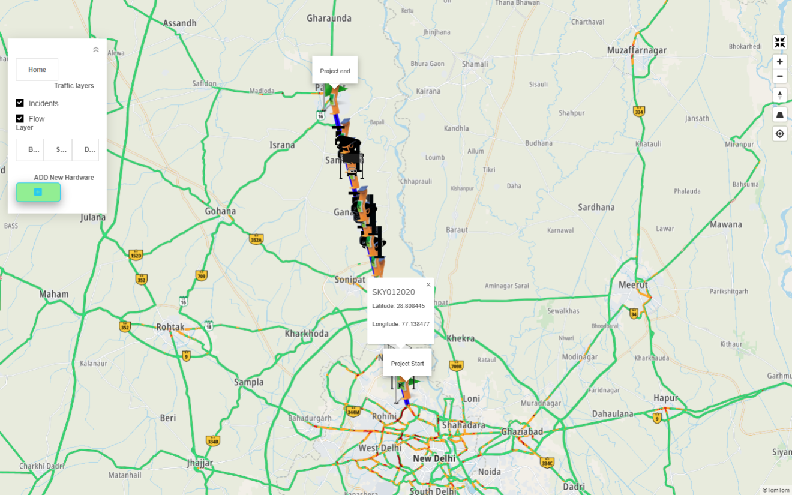
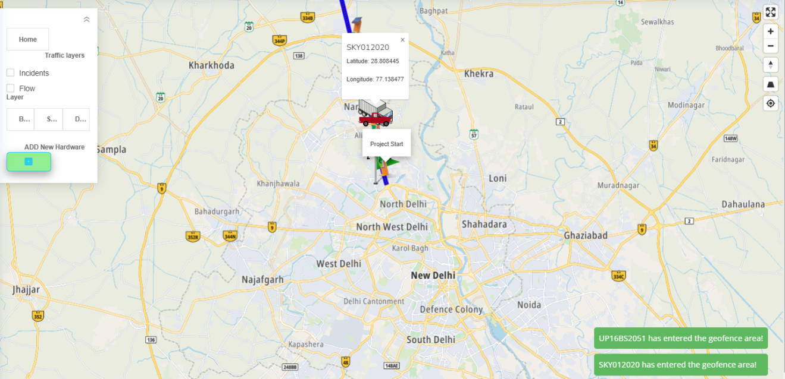

# GIS-Based Traffic Incident Mapping 

## Overview

The **GIS-Based Traffic Incident Mapping System** is a web-based platform that provides real-time traffic incident mapping and management, helping optimize traffic flow, detect wrong-side driving, and coordinate emergency responses. This system integrates data from traffic cameras, sensors, and various hardware devices such as **VMS**, **CCTV**, **VIDES**, **MET**, **ECB**, and **ATCC** to offer a comprehensive solution for traffic management and safety.

## Key Features

1. **Real-Time Traffic Incident Mapping**:
   - Displays real-time incidents, such as traffic accidents or wrong-side driving, on a GIS map.
   - Offers real-time updates on traffic conditions through sensors and cameras.

2. **Traffic Flow Optimization**:
   - Analyzes traffic flow patterns and identifies congestion hotspots.
   - Provides insights to improve road efficiency and reduce congestion.

3. **Emergency Response Coordination**:
   - Provides real-time information to emergency services and hospitals.
   - Coordinates emergency responses to reduce incident response times.

4. **Geofencing**:
   - Enables the creation of geofenced zones for better control over traffic monitoring and emergency dispatch areas.

5. **Hardware Integration**:
   - Includes hardware icons on the map to show status updates and enable control actions for each device (e.g., updating or deleting).

## User Requirements

- Real-time traffic and incident data updates.
- Integration of geofencing for emergency dispatch routes.
- Improved traffic management through data-driven decision-making.

## Installation

### Prerequisites

- **Hardware**:
  - Windows 10 or 11
  - Intel i5 Processor
  - 8GB RAM
  - 500GB SSD

- **Software**:
  - Microsoft Visual Studio Community
  - PostgreSQL Database

### Steps to Set Up

1. **Clone the Repository**:
   ```bash
   git clone https://github.com/ThasnimaShereef/GIS-Based-Traffic-Incident-Mapping.git
   ```

2. **Set Up the Database**:
   - Use PostgreSQL to set up the database schema with tables for devices, incidents, and traffic data.

3. **Run the Application**:
   - Open the solution in Visual Studio and configure the project for **ASP.NET MVC**.
   - Build and run the application.

## System Architecture

The system is designed following **Structured Analysis & Design (SAD)** and **Object-Oriented Design (OOD)** methodologies. Major components include:

- **Incident Reporting**: Real-time data reporting from hardware devices.
- **Traffic Monitoring**: Continuous tracking and analysis of traffic patterns.
- **Emergency Response**: Automatic dispatch notifications to emergency services based on incident data.

## Screenshots


*Visualizing traffic flow and incidents on the map.*


*Geofencing notifications for vehicles.*

 
